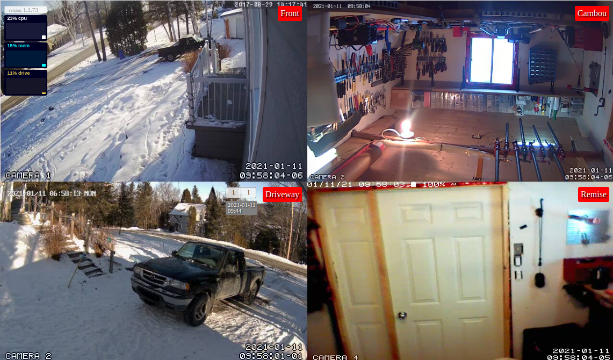
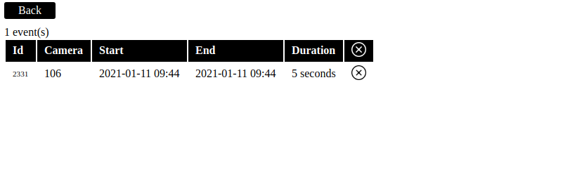

# Motion Front-End Application





## About

Motion front-end for motion project. [Motion](https://motion-project.github.io/) is a great software for detecting motion in cameras and saving movies but front end lacks some functionalities, like displaying and deleting saved movies and images. This project aims to circumvent those limitations by providing only a front acces to motion.

### 

With this project, you can:
 - Configure motion normally (ie config files)
 - Read movies create by motion safely from your browser
 - Delete recordings from your browser
 - Get push notifications when an event occurs
 - Install a progressive web app (PWA) on your mobile device
 - Display streams on old devices (ie iPad 1) 

This project does not offer:
 - An out-of-the-box wizard installer
 - A configuration page to edit motion parameters

### Rationale

After trying several motion-detecting software (Shinobi, Zoneminder, etc.), we felt that motion had the simplest approach and was more robust and less hardware demanding being coded in C. The server had to run on an old PC while the frontend had to be run on old devices like iPad 1.

## Table of contents

1. Install Postgresql 
2. Install motion
3. Install motion-ui
4. Configure tasks
5. Install a reverse proxy

## 1. Install Postgresql

### 1.1 Install Postgresql
```bash
# Create the file repository configuration:
sudo sh -c 'echo "deb http://apt.postgresql.org/pub/repos/apt $(lsb_release -cs)-pgdg main" > /etc/apt/sources.list.d/pgdg.list'

# Import the repository signing key:
wget --quiet -O - https://www.postgresql.org/media/keys/ACCC4CF8.asc | sudo apt-key add -

# Update the package lists:
sudo apt-get update

# Install the latest version of PostgreSQL.
# If you want a specific version, use 'postgresql-12' or similar instead of 'postgresql':
sudo apt-get -y install postgresql
```

@see [Postgresql](https://www.postgresql.org/download/linux/ubuntu/)

### 1.2 Create User
```bash
# Create motion user in Postgres
sudo -u postgres createuser -D -P motion

# Create motion database for motion user
sudo -u postgres createdb -O motion motion
```

### 1.3 Update Postgresql config

You must update postgresql configuration to allow password based authentication (if you have not already done this).

Add the following to `pg_hba.conf` or `postgresql.conf` (depending on version of postgresql installed) located in folder `/etc/postgresql/<version>/main/`
```
host all all 127.0.0.1/32 password
```

After you have updated, restart the postgres server:
```bash
sudo service postgresql restart
```


## 2. Install motion

### 2.1 Install motion

```bash
sudo apt-get install motion
```

@see [motion-project](https://motion-project.github.io/motion_build.html)

### 2.2 Configure motion

Add the following configurations to `motion.conf`

```
############################################################
# System control configuration parameters
############################################################
# Do not start in daemon (background) mode.
# We will use pm2 to start motion
daemon off
# Target directory for pictures, snapshots and movies
target_dir YOUR_TARGET_DIRECTORY_FOR_FILES

############################################################
# Database configuration parameters
############################################################
database_type postgresql
database_dbname motion
database_user motion
database_password YOUR_PASSWORD_DEFINED_AT_STEP_1
database_port 5432

############################################################
# Event database logging parameters
############################################################
sql_query_start insert into event_logs(camera, event, begin, end) values('%t', '%t.%v.%C', '%Y-%m-%d %T', null)
sql_query insert into events(camera, event, time, type, frame, filename) values('%t', '%t.%v.%C', '%Y-%m-%d %T', '%n', %q, '%f')
sql_query_stop update event_logs set end='%Y-%m-%d %T' where camera='%t' and event='%t.%v.%C'

############################################################
# Script execution configuration parameters
############################################################
on_event_start /usr/bin/curl --location --request POST 'localhost:3000/v1/events/%t/status?type=start'
on_event_end /usr/bin/curl --location --request POST 'localhost:3000/v1/events/%t/status?type=end'
on_camera_lost /usr/bin/curl --location --request POST 'localhost:3000/v1/streams/%t/status?type=lost-connection'
on_camera_found /usr/bin/curl --location --request POST 'localhost:3000/v1/streams/%t/status?type=connection-ok'

############################################################
# Live stream configuration parameters
############################################################
# The port number for the live stream.
stream_port 8081
# Restrict stream connections to the localhost (on is ok if you have set reverse proxy on localhost).
stream_localhost off

############################################################
# Webcontrol configuration parameters
############################################################
# Port number used for the webcontrol.
webcontrol_port 8080
# Restrict webcontrol connections to the localhost.
webcontrol_localhost on
# Type of configuration options to allow via the webcontrol. Must be set to 2.
webcontrol_parms 2
```

Don't forget to:
* Change target_dir
* Create target dir of cameras.

@see [motion-project](https://motion-project.github.io/motion_config.html)

## 3. Install motion-ui
### 3.1 Install dependencies
Install the needed libraries and programs
* git
* nodejs  
* pm2

```bash
sudo apt-get install nodejs
sudo apt-get install git
npm install -g pm2
```

### 3.2 Get this project from github

```bash
git clone git@github.com:glennerichall/motion-ui.git
```

### 3.3 Edit ecosystem.config.js

Optional: If changed from default, replace MOTION_HOST with your own config from motion defined at step 2 `webcontrol_port 8080` 

```javascript
// these configs are optional, they defaults to
env_production: {
    PORT: 3000,
    MOTION_HOST: 'http://localhost:8080'
}
```

@see [motion webcontrol_port](https://motion-project.github.io/motion_config.html#webcontrol_port)

@see [motion stream_port](https://motion-project.github.io/motion_config.html#stream_port)

### 3.4 Create pconfig.json

Create a file name "pconfig.json" in motion-ui root directory

```json
{
  "type": "postgres",
  "options": {
    "user": "motion",
    "database": "motion",
    "host": "localhost",
    "password": "YOUR_PASSWORD_DEFINED_AT_STEP_1"
  }
}
```

### 3.5 Generate a startup script 

```bash
pm2 startup
```
Then read and execute the printed command

@see [pm2](https://pm2.keymetrics.io/docs/usage/startup/)

## 4. Configure tasks

### 4.1 Configure logrotate for motion

Edit logrotate for motion.log (or your log file defined in motion.conf)

```bash
sudo nano /etc/logrotate.d/motion
```

@see [logrotate](https://linux.die.net/man/8/logrotate)

@see [motion config / log_file](https://motion-project.github.io/motion_config.html#OptDetail_System_Processing)

### 4.2 Configure logrotate for pm2

```bash
pm2 install pm2-logrotate
```

@see [pm2-logrotate](https://github.com/keymetrics/pm2-logrotate#configure)

### 4.3 Configure pm2 app for motion

When motion creates files, it creates them using motion user and motion group if motion is started as daemon. Unfortunately, other users can't delete them using motion group as directories are created with `drwxr-xr-x` rights. So, we let pm2 start and restart motion with your current user (motion and motion-ui must be started with same user).

```bash
pm2 start motion
```

### 4.4 Save pm2 app list

Once you started all the applications you want to manage, you have to save the list you wanna respawn at machine reboot with:

```bash
pm2 save
```

## 5. Install a reverse proxy

### 5.1 Create a password for user to log in your front-end

Restrict access to your website by implementing a username/password authentication:

```bash
sudo -c htpasswd /etc/apache2/.htpasswd YOUR_USERNAME
```

Press Enter and type the password for YOUR_USERNAME at the prompts.

@see [nginx](https://docs.nginx.com/nginx/admin-guide/security-controls/configuring-http-basic-authentication/)
### 5.2 Install Nginx
```bash
sudo apt install nginx
```

### 5.3 Configure Nginx as a reverse proxy
Edit the file with nano:

- You can change `localhost` with ip of other machine running motion and motion-ui if nginx is on another computer
- Use a dynamic dns provider to get a dns name and replace YOUR_DNS_NAME
- Get a certificate from Let's encrypt

```bash
sudo nano /etc/nginx/sites-available/motion
```


```nginx
# Non-secured connection redirection
server {
        listen 0.0.0.0:80;
        server_name YOUR_DNS_NAME;
        location / {
           return 301 https://$http_host$request_uri;
        }

        # Use by let's encrpyt
        location /.well-known {
            root /var/www/letsencrypt;
        }
}

# The secured server
server {
        listen 0.0.0.0:443 ssl;
        
        # Set your DNS name here
        server_name YOUR_DNS_NAME;

        # Set your basic auth file here
        auth_basic "Credentials needed";
        auth_basic_user_file /etc/apache2/.htpasswd;
        
        # This is the default proxied route
        # Change localhost:port for your needs  
        location / {
            proxy_pass http://localhost:3000/;
            proxy_http_version 1.1;
            proxy_set_header X-Forwarded-Proto 'https';
            proxy_set_header X-Forwarded-Host $host;
            proxy_set_header X-Forwarded-For $proxy_add_x_forwarded_for;
            proxy_set_header X-Stream-Host https://$host;
       }
        
        # This is the proxied websocket using socket.io
        # Change localhost:port for your needs  
        location /socket.io/ {
            proxy_pass http://localhost:3000/socket.io/;
            proxy_set_header Upgrade $http_upgrade;
            proxy_set_header Connection "Upgrade";
            proxy_set_header Host $host;
        }

        # These are the streams provided by motion
        # Those routes contains the ids of the cameras ie 101, 102, etc.
        # A better way would be to use regexp for camera ids
        # Change localhost:port for your needs  
        location /101/stream {
           proxy_pass http://localhost:8081/101/stream;
        }

        location /102/stream {
           proxy_pass http://localhost:8081/102/stream;
        }
        
        # Encrypt communications
        ssl on;
        ssl_certificate /etc/letsencrypt/live/YOUR_DNS_NAME/fullchain.pem;
        ssl_certificate_key /etc/letsencrypt/live/YOUR_DNS_NAME/privkey.pem;

        # If you need backwards compatible ciphers
        ssl_ciphers "ECDHE-RSA-AES256-GCM-SHA384:ECDHE-RSA-AES128-GCM-SHA256:ECDHE-RSA-AES256-SHA384:ECDHE-RSA-AES128-SHA256:ECDHE-RSA-AES256-SHA:ECDHE-RSA-AES128-SHA:ECDHE-RSA-DES-CBC3-SHA:AES256-GCM-SHA384:AES128-GCM-SHA256:AES256-SHA2$
        ssl_protocols TLSv1 TLSv1.1 TLSv1.2;
        ssl_prefer_server_ciphers on;
        ssl_session_cache shared:SSL:10m;
        ssl_session_timeout 5m;

}
```

### 5.4 Define firewall rules

```bash
# default http port
sudo ufw allow 80/tcp

# default https port
sudo ufw allow 443/tcp

# default ssh port
sudo ufw allow 22/tcp

# deny all other incoming trafic
sudo ufw default deny incoming

# enable firewall
sudo ufw enable
```

## 6. Future considerations

Typical installation has motion-ui installed on same server as motion. While we try to abstract all aspects of the stack as possible, currently motion-ui can only run on the same server as motion. Eventually, motion-ui files and movies could be served statically from a CDN and motion-ui backend run on the cloud, keeping your personal and local network safe from the Internet by disabling NAT all along in your router. 
